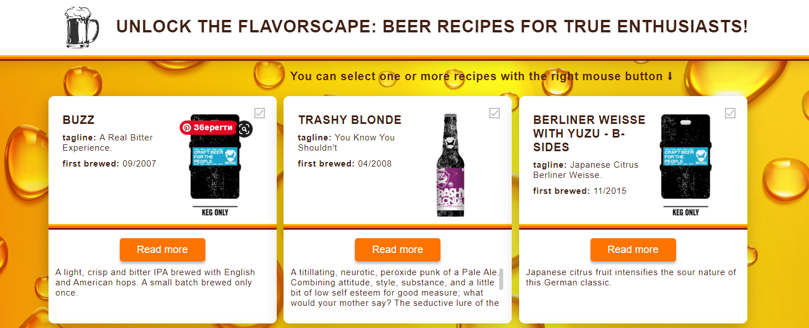

## TWEETS CARDS

** ⤵️** WELCOME TO BEER RECIPES **⬇️ **
[life page...](https://polaolka.github.io/beer_recipes/)

## Project overview
This website is a virtual beer treasure trove where you'll find the freshest and most fascinating beer recipes to unleash your creative potential and savor the unmatched taste of your own brewing.

## Requirements
Before starting work with the project, make sure that the following tools are installed on your computer:
- You need to enable NodeJs to run this app.

## Installation
1. Clone this repository to your local machine.
2. Open a terminal and navigate to the root of your project.
3. Run the `npm install` command to install the project dependencies.
4. Scripts: - npm start 

### Developers
The project was implemented by:

  

- [**Olga Polishchuk**: Full-stack developer](https://github.com/Polaolka)
